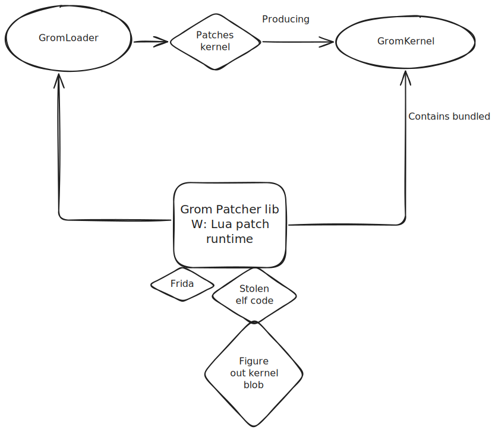

# Grom Planning

Current flow: \([link](https://excalidraw.com/#json=BTJirhyglFXfB8qjR7aIf,KPWF0iEJCK9x6K_9kToUfA)\)

Todos: 
* https://github.com/Grometheus/Planning/issues/1
* https://github.com/Grometheus/Planning/issues/2

Doing:
* N/a

